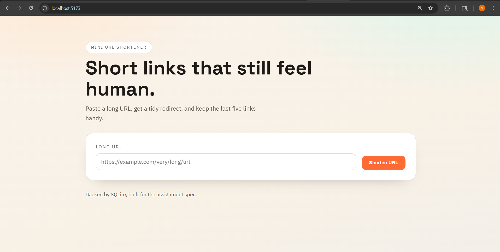
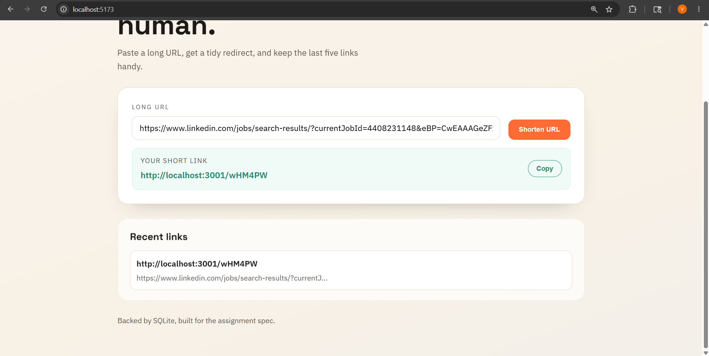

# URL Shortener

A mini full-stack URL shortener with a React frontend and an Express API backed by SQLite.

## Features
- Shorten long URLs with validation and error handling.
- Redirect short codes to the original URL.
- Persistent storage in SQLite (survives restarts).
- Shows the most recent 5 shortened URLs in the UI (stored in localStorage).

## Demo

Screenshots:





Screen recording:

[screenshots/screen-recording.mp4](screenshots/screen-recording.mp4)

## Tech Stack
- React + Vite (frontend)
- Express (API)
- better-sqlite3 (database)
- Node.js 18+

## Requirements
- Node.js 18+
- npm

## Quick Start (Clone and Run)
```bash
git clone <your-repo-url>
cd url-shortener
npm install
npm run dev
```

This starts both the frontend and the API:
- Frontend: http://localhost:5173
- API: http://localhost:3001

The SQLite file `urls.db` is created in the project root on first use.

## Available Scripts
- `npm run dev` runs both Vite and the API server.
- `npm run dev:client` runs only the Vite frontend.
- `npm run dev:server` runs only the API server.
- `npm run build` builds the frontend for production.
- `npm run preview` serves the production build locally.
- `npm run start` runs the API server in production mode.

## Environment Variables
- `PORT`: API port (default: `3001`).
- `NODE_ENV`: when set to `production`, the API generates `https` links.

## API Usage

### POST /api/shorten
Request body:
```json
{ "url": "https://example.com/long-path" }
```

Success (201):
```json
{ "shortCode": "aB3xZ9", "shortUrl": "http://localhost:3001/aB3xZ9" }
```

Error (400):
```json
{ "error": "Human-readable error message." }
```

### GET /:code
Redirects (302) to the original URL.

## cURL Examples (Windows)

Create a short URL:
```bash
curl.exe -i -X POST http://localhost:3001/api/shorten ^
	-H "Content-Type: application/json" ^
	-d "{\"url\":\"https://example.com\"}"
```

Follow a redirect:
```bash
curl.exe -iL http://localhost:3001/aB3xZ9
```

## How the Recent 5 URLs Are Shown
The UI stores recent links in `localStorage` under the key `urlHistory`. Each new short URL is prepended and the list is trimmed to 5 entries.

## Database Notes
SQLite data is stored in `urls.db` at the project root. The table schema:

```
urls (
	id INTEGER PRIMARY KEY AUTOINCREMENT,
	code TEXT NOT NULL UNIQUE,
	long_url TEXT NOT NULL,
	created_at TEXT DEFAULT (datetime('now'))
)
```

To view data without a GUI:
```bash
node --input-type=module -e "import Database from 'better-sqlite3'; const db=new Database('urls.db'); console.log(db.prepare('select code, long_url, created_at from urls').all());"
```

## Troubleshooting
- `curl` fails or connection refused: make sure the API server is running.
- `404` on a short code: that code does not exist in `urls.db`.
- Short URLs show the wrong port: confirm the API port (`PORT`) and Vite proxy settings.
- `urls.db` looks like garbage in a text editor: SQLite files are binary; use a SQLite viewer.

## Project Structure
```
server/        # Express API + SQLite access
src/           # React app
public/        # Static assets
urls.db        # SQLite database file (created at runtime)
vite.config.js # Frontend dev server config
```

## Known Limitations
- No custom short codes.
- No click tracking or analytics.
- Not deployed.
